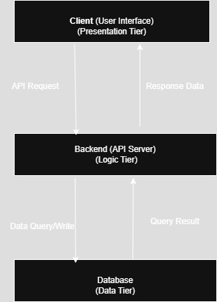

## Architecture Overview

The system follows a classic 3-tier architecture model, which separates concerns into three layers:

- **Client Tier (Presentation)**: The user's browser or frontend application.
- **Backend Tier (Application Logic)**: The API server or backend logic layer.
- **Database Tier (Data Storage)**: Stores user data and application information.

